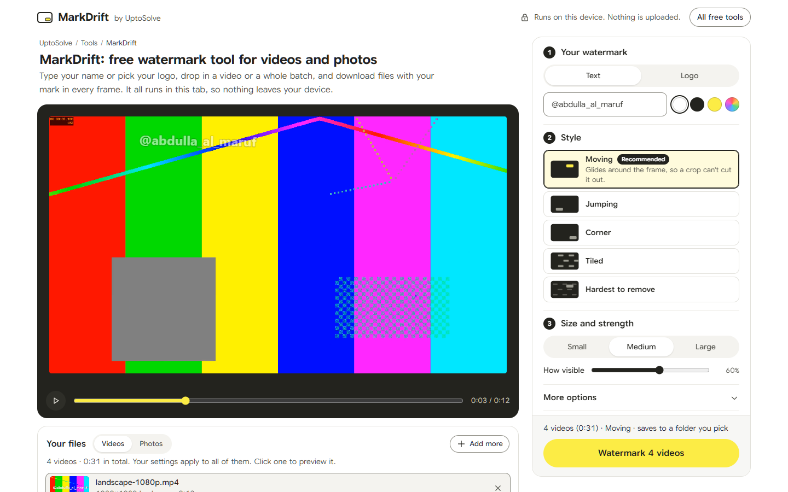

# MarkDrift

A free watermark tool for videos and photos that runs in your browser. Use it at **https://uptosolve.com/tools/watermark-video/**



I wanted a moving watermark on my videos, the kind that drifts across the frame so nobody can crop it out. The tools I found charged credits for it, per video, and wanted the file uploaded to their servers first. Drawing a logo on each frame doesn't need a server. A browser can do it on your own machine. So MarkDrift is free, has no account, adds no watermark of its own, and your files stay on your computer.

It's made by [UptoSolve](https://uptosolve.com) and released under the MIT license.

## Features

- Video in: MP4, MOV, WebM, MKV. Video out: H.264 in MP4, which plays in every phone gallery and editor I know of. If the browser can't encode H.264, you get WebM instead.
- Photos: JPG, PNG, WebP. Several photos come back as one ZIP.
- Many videos at once. Drop a whole folder's worth, landscape and vertical mixed. One set of settings applies to all of them, and every size is measured against the short side of the frame, so the mark looks the same on 720p, 4K, vertical or landscape. Click any file in the list to preview it.
- Videos are processed one after another. Chrome and Edge save them into a folder you pick once. Other browsers download each one when it's done. One failed file doesn't stop the rest, and Stop keeps whatever has already finished.
- Text or logo. Text has four font styles, colour, bold and an outline. A logo can be PNG, JPG, SVG or WebP, and can be turned white.
- Five styles (the internal mode name is in brackets):
  - Hardest to remove (`combo`): faint marks tiled across the frame, plus one clear mark that moves
  - Moving (`bounce`): glides and bounces off the edges, like the old DVD logo
  - Tiled (`tile`): repeats across the whole frame, and can drift slowly
  - Jumping (`jump`): pops up somewhere new every few seconds
  - Corner (`fixed`): stays in one of nine spots
- Extra protection, which the code calls wobble or jitter: small, smooth changes in size, angle and opacity over time, so the mark is never quite the same in two frames.
- A pattern seed. It starts random and the Shuffle button picks a new one, so your marks don't follow the same path as anyone else's and a removal mask built for one pattern won't line up with another.
- The live preview matches the export frame for frame.
- Audio is copied as it is when possible. Opus or PCM audio gets converted to AAC so the MP4 plays everywhere. Firefox has no AAC encoder, so there it becomes Opus.
- Rotated phone footage comes out upright, with the mark upright too.
- "Keep original quality" matches the source bitrate, so the file size stays close to the original. There's also a bigger "best quality" option and a "smaller file" one.
- Videos over 400 MB are written straight to disk in Chrome and Edge, so they don't have to fit in memory.

## How it works

There is no backend. The whole app is static files.

1. [mediabunny](https://mediabunny.dev) opens the file, decodes frames with the browser's WebCodecs API, and writes the new MP4. WebCodecs uses the device's hardware encoder where there is one.
2. Each decoded frame is drawn onto a canvas.
3. `renderWatermark(ctx, W, H, t, settings, stamp)` in `src/watermark.js` draws the mark on top.
4. The canvas goes back to mediabunny to be encoded and muxed, with the audio track.

`renderWatermark` is a pure function of the time `t`. The preview calls it with `video.currentTime` and the exporter calls it with each frame's timestamp, and nothing else changes the result. That's why the preview and the file you download match.

The motion math (bounce, jump, tile, wobble, the seeded noise) lives in `src/motion.js` with no DOM access, so it runs and is tested in plain Node.

Speed depends on the machine. On my mid-range dev laptop, a 3-minute 1080p clip took about 19 seconds in Chrome. A slower laptop or a phone will take longer.

## Privacy

Your videos, photos and logo are read from your disk by the browser and processed in the page. They are never uploaded, because there is nowhere to upload them to. The font is self-hosted. You can check this yourself: open the browser's Network tab and export a video. On uptosolve.com you'll see the page's own files plus one small request to Cloudflare Web Analytics, a cookieless page-view counter that's on for the whole uptosolve.com domain. None of those requests carry your files.

Settings (text, style, sliders) are saved in your browser's localStorage so they're there next time. They never leave the device.

## Browser support

| Browser | Video | Photos | Tested? |
|---|---|---|---|
| Chrome / Edge 94+ | Yes | Yes | Yes, on Windows (automated e2e runs in Chrome) |
| Firefox 130+ (desktop) | Yes | Yes | Yes, Firefox 153 on Windows (automated e2e) |
| Safari 17+ | Should work | Should work | Not yet. All testing so far was on Windows |
| Chrome on Android | Should work | Should work | Not yet on a real phone |
| Older browsers without WebCodecs | No, the page says so | Yes | |

If you run it on Safari or a phone and something breaks, please [open an issue](https://github.com/uptosolve/markdrift/issues/new/choose) with the browser version and the file type.

## Limits and honest notes

- Not AI-proof. Moving, tiled and wobbling marks take more work to crop or blur out than a logo in a corner, but they can be removed. A March 2026 test found that current AI removal tools get past both tiling and jitter.
- Speed is your device's speed. Everything runs locally, so a phone is fine for a short clip, and long 4K videos are better on a computer.
- It's not an editor. No trimming, cropping, cutting or filters. It stamps a mark and gives the file back.
- Unless the video is over 400 MB and you're in Chrome or Edge, the finished file is held in memory until it's saved. A very large file on a phone can run out of memory.
- There's no invisible or forensic watermark. What you see is the whole mark.

## Development

You need Node 22.12 or newer (Vite 8 and puppeteer-core ask for it).

```bash
npm install
npm run dev              # starts Vite, open the URL it prints
npm test                 # unit tests (Node's built-in test runner)
npm run make-test-media  # test videos and photos in test-media/ (needs bash and ffmpeg)
npm run e2e              # real exports in Chrome and Firefox, checked with ffprobe
npm run build            # static site in dist/
```

`npm run dev` and `npm run build` first run `scripts/build-pages.mjs`, which generates the pages in `site/` from `content/` and the app markup in `index.html`. Vite then serves or builds `site/` under the `/tools/` base path. The build ends up in `dist/tools/`.

`npm test` covers the motion math and the Firefox H.264 fix. It needs no browser.

`npm run e2e` is the real check. It starts the dev server, loads every test video in a real browser, exports each one in a different style, then checks the output with ffprobe and a full ffmpeg decode: codec, size, duration, frame count, audio, and no decode errors. It also covers cancel, photo export, ZIP batches, batch save to a folder, Stop in the middle of a batch, and a slow load not overwriting a newer one. It needs Chrome and/or Firefox installed in the usual place, `ffmpeg` and `ffprobe` on your PATH, and the test media. `npm run e2e -- chrome` runs one browser only (`chrome`, `edge` or `firefox`). On Windows, run `make-test-media` from Git Bash or WSL.

The e2e suite doesn't run in CI (see `.github/workflows/ci.yml`). CI runs `npm test` and `npm run build`.

In dev mode, `vite.config.js` adds two helper routes for the e2e tests, `/__save` and `/__media`. They only exist in the dev server and are never part of the build.

### A Firefox quirk worth knowing

Firefox on Windows encodes H.264 through Media Foundation, and the decoder config (avcC) it hands back repeats the first byte of every SPS and PPS. ffmpeg plays the file anyway, but Chrome and many players stall on it. `src/encoder-fix.js` repairs the record before the muxer writes it, and `tests/encoder-fix.test.js` has the exact bytes from Firefox 153. The same file also switches to software decoding after Firefox runs out of hardware decoders. Please don't remove it.

## Deploy

The build is plain static files, so it runs on Cloudflare's free plan. uptosolve.com serves it from a Cloudflare Worker with static assets only (no Worker script), on the routes `uptosolve.com/tools/*` and `uptosolve.com/tools`. The rest of uptosolve.com is a separate site.

The Worker's assets settings:

```jsonc
{
  "name": "markdrift",
  "compatibility_date": "2026-10-01",
  "assets": {
    "directory": "./dist",
    "html_handling": "auto-trailing-slash",
    "not_found_handling": "404-page"
  },
  "routes": [
    { "pattern": "uptosolve.com/tools/*", "zone_name": "uptosolve.com" },
    { "pattern": "uptosolve.com/tools", "zone_name": "uptosolve.com" }
  ]
}
```

```bash
npm run build
npx wrangler deploy
```

Each file in `dist/` has to stay under 25 MiB, the per-file limit for static assets. The largest file is the video engine at about 580 KB (146 KB gzipped), and it only loads when you open a video.

To host your own copy somewhere else, any static host works. If you serve it from a different path or domain, change `base` in `vite.config.js` and `ORIGIN` in `scripts/build-pages.mjs` (it writes the canonical URLs).

## Project layout

```
index.html           the app markup, reused by every tool page
scripts/             page generator and build helpers
content/             page copy: pages.json and one HTML fragment per page
site/                generated pages (not committed)
src/main.js          UI, state, file handling, preview loop, export flow, batch queue
src/watermark.js     builds the watermark stamp once per size and draws it for a given time
src/motion.js        pure motion math: bounce, jump, tile, wobble, seeded noise
src/video.js         mediabunny conversion pipeline (loaded lazily)
src/image.js         photo export and ZIP
src/settings.js      defaults and saved settings
src/encoder-fix.js   Firefox avcC repair and decoder fallback
src/icons.js         line icons
src/fonts.css        self-hosted Google Sans Flex
src/style.css        styles
public/              fonts, favicon, _headers
tests/               unit tests
tests/e2e/           browser export tests and the test media script
docs/                screenshots and the social preview
PRODUCT.md           who it's for and the product rules
DESIGN.md            the design system
```

## Contributing

Bug reports and small pull requests are welcome, and so are test results from Safari and real phones. [CONTRIBUTING.md](CONTRIBUTING.md) has the rules that keep the preview and the export in sync, how to add a motion style, and what "done" means. Security problems go through [SECURITY.md](SECURITY.md), not public issues.

If you're an AI assistant working on this repo, the same file is the one to read first. The short version: keep `renderWatermark` and `src/motion.js` pure, measure sizes against `min(W, H)`, add nothing that sends user files anywhere, and keep `npm test` and `npm run e2e` green.

## License

MIT. See [LICENSE](LICENSE).

## Credits

- [mediabunny](https://mediabunny.dev) by Vanilagy reads, decodes, encodes and muxes the video. It's licensed under MPL-2.0 and used unmodified from npm; its license notice stays in the built file.
- [fflate](https://github.com/101arrowz/fflate) (MIT) builds the ZIP files.
- [Google Sans Flex](https://github.com/googlefonts/googlesans-flex), self-hosted, is licensed under the SIL Open Font License 1.1.
- Built with [Vite](https://vite.dev).
